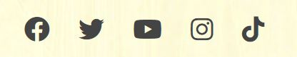

# JapanEasy!

Have you even been to Japan and seen all kinds of signs and wanted to know what they mean? Or maybe you were watching your favourite anime and saw a bunch of symbols you didn't understand but wanted to? Perhaps learning a foreign language is one of your life goals and Japanese seems the coolest but you are faced with the inpenetrable barrier that is learning a new "alphabet" before you can even start?

Well learning Japanese does not need to be so hard! Infact it's JapanEASY! This website is designed to help you hit the ground running by teaching you Hiragana in a fun but challenging way.

As a person who shares a love of Japan with a complete inability to learn foreign languages, I found that the only way I could progress was through gamification. This game is designed with simplicity and functionality at heart allowing focus to remain solely on learning of the syllabary whilst still remaining fun.

You can visit the live website [here](https://lordbutley.github.io/JapanEasy/)

# Contents

Add index

# UX

## Project Goals

* Create a user-friendly and accessible website.
* Create a learning game that is straight forward to start, play and restart.
* Create a translation game that can be played with questions in English or Hiragana.
* Ensure that questions are randomised and not repeated
* Ensure that answers are randomised so that the language is learnt rather than the questions
* Provide the user with constant feedback on their progress through the game and through the site. 
* Give the website a Japanese feel through imagery.
* Ensure the website is viewable across devices of all sizes.
* To create a website that would be immediately useful when live but also has scope to be expanded.

## User Stories

* As a user visiting the site for the first time, I want to be able to navigate the website intuitively.
* As a user visiting the site for the first time, I want to be able to play the game quickly and easily
* As a user, I want to be able to access the website on desktop, tablet and mobile devices to ensure convenience.
* As a user, I want to be able to easily access the social media accounts of "Japaneasy". 
* As a user, I want to be provided with feedback such as correct and incorrect scores to allow me to monitor my learning progress.
* As a user, I want to be able to choose whether the questions are in English or Hiragana.
* As a user, I want the questions *and* answers to be randomised to help with learning.

## Target Audience

The target audience of this website is any person who :

* wants to learn Japanese
* is learning Japanese and wants a helpful learning aid
* has learnt japanese and wants a revision aid

## Structure

The website is focussed entirely on the learning quiz. As such there is a single HTML page that is manipulated through CSS and Javascipt so not to distract from the sites goals. This manipulation results in 3 distinct parts:

- Welcome page - This contains and introduction and brief explanation of the intuitive quiz controls and well as the controls themselves.
- Quiz page - This is generated through JavaScript and contains a question and a number of answers determined by the difficulty setting.
- End game page - This contains the score achieved in the quiz.

## Skeleton

The initial ideas were taken from the structure planning and a visual mock up was created using Balsamiq. Mobile, Tablet, and Desktop wireframes are all available [here.](wireframes/wireframes.pdf).

There were improvements made to the structure from the wireframes to improve the user experience. These were :

- Changes to headings/titles
- The navigation bar does not stick on small screens as it takes up too much screen space.

## Surface

### Colour Palette

### Typography

### Language / Tone

### Imagery

### Layout

# Features

## Existing Features

### Header

<!-- - Logo "It's Puppy Time" in large unmissable font sets the tone of the website.
- Navigation bar - Allows users to quickly see what content is available on the website and then navigate where they want in a simple, familiar and intuitive way. The current page is highlighted whilst the links are underlined when the cursor is on top. 
- Header is sticky on large devices but loses it's "stickiness" on smaller screens where you have less screen estate.

 -->

### Footer

<!-- - The Footer contains links to the "It's Puppy Time" social media websites. These open to a new tab upon click. The footer is set to stick once it becomes fully visible on the page. This was created to prevent the footer floating in the middle of the page.

 -->

### Home Page

<!-- - Hero image - Large image with two puppies sitting centrally is used to give users an immediate feeling of happiness and also show instantly what the website is about. The colour identity of the website is established between the header and the hero photo. The colours from the header and footer were taken from the hero image.

- Page summary tiles - Tiles were used to represent each different page. These tiles contain an image, the section title and a short summary of what will be found on that page. Each tile contains a button to take you to the relevant page. The tiles have curved corners for a softer looker. The curved edges are removed for smaller viewports.

- Contact tile - A smaller tile was chosen without an image as it is not the main purpose behind people visiting the website and so should not be the focus. This is in keeping with web norms. The tile has a button to take you to the contact us page. The tiles have curved corners for a softer looker. The curved edges are removed for smaller viewports.

 -->

### Quiz page

<!-- - Each of these pages contains the same layout in keeping with good user experience.
- The header, footer and horizontal dividers detailed above.
- A container with an image on the left, a header and content on the right.
- A container with an image on the right, a header and content on the left.

 -->

### End Game page

<!-- - Styling follows on from the rest of the website.
- The header, footer and horizontal dividers detailed above.
- Contains a form which contains the fields; first name, last name, email, dog breed and message.
- Form submission landing page gives users feedback. It also contains all navigation functionality.

 -->

## Features to implement in the future

- Add additional syllabaries such as Katakana and eventually Kanji

## Technologies Used

 ### Languages Used:

 1. [HTML](https://en.wikipedia.org/wiki/HTML) 
 - Programming language providing content and structure of website.

 2. [CSS](https://en.wikipedia.org/wiki/CSS) 
 - Programming language providing styling of website.

 3. [JavaScript](https://en.wikipedia.org/wiki/Javascript)
 - Programming language used for the functions and interactivity behind the quiz.
 
 ### Frameworks, Libraries & Programs Used:

    
 1. [GitPod](https://gitpod.io/)
    - IDE (Integrated Development Environment), for writing, editing and saving code.

 2. [GitHub](https://github.com/) 
    - Remote hosting platform and code  repository.

 3. [Balsamiq](https://balsamiq.com/):
    - Balsamiq was used to create the initial designs for the pages on the site.

 4. [Favicon](https://favicon.io/):
    - Favicon used to implement a favicon on the browser tab.
 
 5. [Google Fonts](https://fonts.google.com/):
    - Google fonts were used to import both the Hachi Maru and Poppins fonts that are used on the site.

6. [Image Colour Picker](https://imagecolorpicker.com/)
    - Website which allows you to find the hexidecimal colour code of a colour in an image.

7. [Pexels](https://www.pexels.com/search/puppies/) 
    - Copywrite free stock images used throughout website

8. [TinyJPG](https://tinyjpg.com/)
    - TinyJPG used to create smaller versions of images enabling quickly load times.

9. [Am I Responsive?](http://ami.responsivedesign.is/)
    - Used to create 4 screen mock up image in Readme.

10. [Google Developer Tools](https://developers.google.com/web/tools) - including Lighthouse
    - Used to constantly test the code and give feedback. 

11. [Responsinator](https://www.responsinator.com/) 
    - Used to check responsiveness across multiple screen sizes quickly.

12. [Font Awesome](https://fontawesome.com/)
    - Used for the social media icons in the footer. 

13. [Toptal](https://www.toptal.com/designers/subtlepatterns/)
    - Copywrite free image used for the background image on the quiz

## Testing

The testing process can be seen in the [TESTING.md](TESTING.md) document.

## 5. Deployment

### Github Pages
The site is hosted using GitHub pages, deployed directly from the master branch of GitHub. The deployed site will update automatically as new commits are pushed to the master branch.

#### How I deployed my project to GitHub pages.
To host on GitHub pages you must follow these steps:

1. Go to [GitHub.com](https://github.com/)
2. Login to my account.
3. Click on 'Responsitories'
4. Click on 'JapanEasy'
5. Go to the 'Settings' tab
6. Scroll down to the 'GitHub Pages' section and set the source to 'main'. This turns on GitHub pages for the repository.
7. Reload the page. Scroll back to 'GitHub Pages' section, where the new URL for the deployed site can be found.

Additional information around these steps can be found on the [GitHub Pages Help Page](https://docs.github.com/en/github/working-with-github-pages/creating-a-github-pages-site).

#### Forking a GitHub Repository
1. Login to GitHub.
2. Locate your desired repository.
3. Locate the fork option in the top-right hand corner of the repository page.    
4. You will be asked where you want to fork it to.

## Credits

### Media
- Background image of ema is from [Pexels](https://www.pexels.com/).
- Background image giving wood effect is from [Toptal](https://www.toptal.com/designers/subtlepatterns/)

### Code

- All code written is my own.

### Content

- All content written is my own and based on my own experiences learning Hiragana and what I would have found more helpful. I took inspiration from all the main Hiragana websites such as 

### Thanks

<!-- - to tutor support at Code Institute. They (John) helped me keep working at my code when I was not sure what to do.
- to my mentor who reviewed my project and gave feedback.
- to my partner who has proof read everything and clicked on every link multiple times
- to the inspiration of this website; my puppy Pickle. -->
