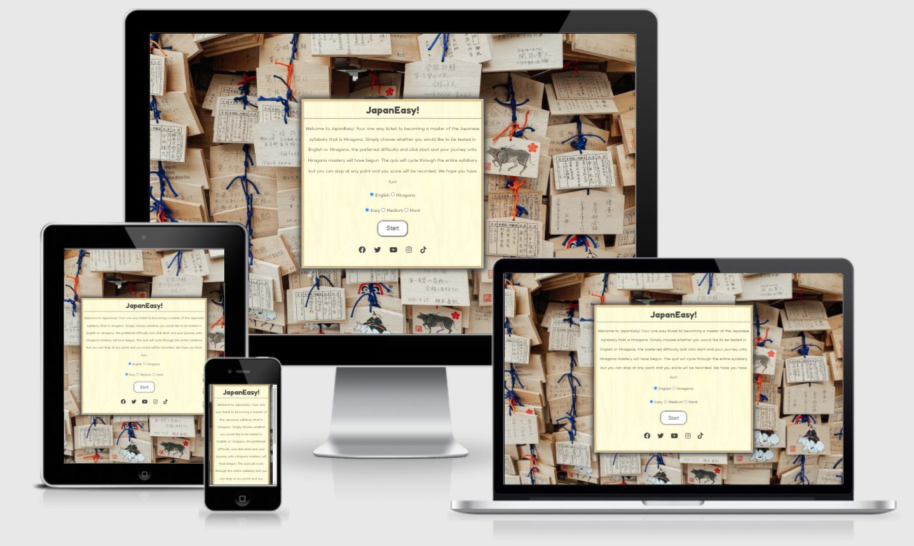
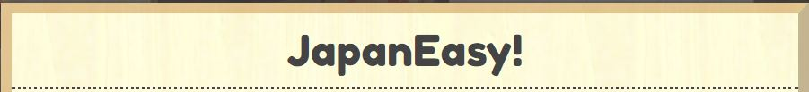
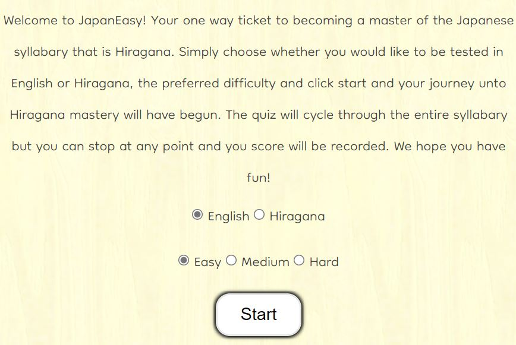
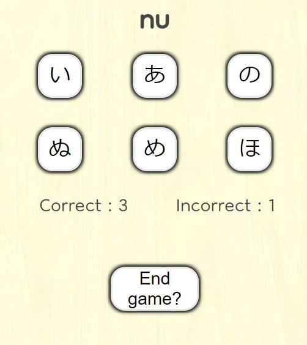
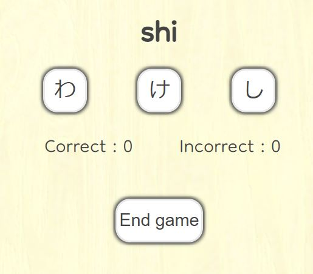

# JapanEasy!

Have you even been to Japan and seen all kinds of signs and wanted to know what they mean? Or maybe you were watching your favourite anime and saw a bunch of symbols you didn't understand but wanted to? Perhaps learning a foreign language is one of your life goals and Japanese seems the coolest but you are faced with the inpenetrable barrier that is learning a new "alphabet" before you can even start?

Well learning Japanese does not need to be so hard! Infact it's JapanEASY! This website is designed to help you hit the ground running by teaching you Hiragana in a fun but challenging way.

As a person who shares a love of Japan with a complete inability to learn foreign languages, I found that the only way I could progress was through gamification. This game is designed with simplicity and functionality at heart allowing focus to remain solely on learning of the syllabary whilst still remaining fun.

You can visit the live website [here](https://lordbutley.github.io/JapanEasy/)

# Contents

- [JapanEasy!](#japaneasy-)
- [Contents](#contents)
- [UX](#ux)
  * [Project Goals](#project-goals)
  * [User Stories](#user-stories)
  * [Target Audience](#target-audience)
  * [Structure](#structure)
  * [Skeleton](#skeleton)
  * [Surface](#surface)
    + [Imagery](#imagery)
    + [Colour Palette](#colour-palette)
    + [Typography](#typography)
    + [Language / Tone](#language---tone)
    + [Layout](#layout)
- [Features](#features)
  * [Existing Features](#existing-features)
    + [Game container](#game-container)
    + [Header](#header)
    + [Footer](#footer)
    + [Background](#background)
    + [Introduction, explanation and choices](#introduction--explanation-and-choices)
    + [Buttons](#buttons)
    + [Quiz page](#quiz-page)
    + [End Game page](#end-game-page)
    + [JavaScript functionality](#javascript-functionality)
  * [Features to implement in the future](#features-to-implement-in-the-future)
  * [Technologies Used](#technologies-used)
    + [Languages Used:](#languages-used-)
    + [Frameworks, Libraries & Programs Used:](#frameworks--libraries---programs-used-)
  * [Testing](#testing)
  * [5. Deployment](#5-deployment)
    + [Github Pages](#github-pages)
      - [How I deployed my project to GitHub pages.](#how-i-deployed-my-project-to-github-pages)
      - [Forking a GitHub Repository](#forking-a-github-repository)
  * [Credits](#credits)
    + [Media](#media)
    + [Code](#code)
    + [Content](#content)
    + [Thanks](#thanks)

# UX

## Project Goals

* Create a user-friendly and accessible website.
* Create a learning game that is straight forward to start, play and restart.
* Create a translation game that can be played with questions in English or Hiragana.
* Ensure that questions are randomised and not repeated
* Ensure that answers are randomised so that the language is learnt rather than the questions
* Provide the user with constant feedback on their progress through the game and through the site. 
* Give the website a Japanese feel through imagery.
* Ensure the website is viewable across devices of all sizes.
* To create a website that would be immediately useful when live but also has scope to be expanded.

## User Stories

* As a user visiting the site for the first time, I want to be able to navigate the website intuitively.
* As a user visiting the site for the first time, I want to be able to play the game quickly and easily
* As a user, I want to be able to access the website on desktop, tablet and mobile devices to ensure convenience.
* As a user, I want to be able to easily access the social media accounts of "Japaneasy". 
* As a user, I want to be provided with feedback such as correct and incorrect scores to allow me to monitor my learning progress.
* As a user, I want to be able to choose whether the questions are in English or Hiragana.
* As a user, I want to be able to set the difficulty of the quiz
* As a user, I want the questions *and* answers to be randomised to help with learning.

## Target Audience

The target audience of this website is any person who :

* wants to learn Japanese
* is learning Japanese and wants a helpful learning aid
* has learnt japanese and wants a revision aid

## Structure

The website is focussed entirely on the learning quiz. As such there is a single HTML page that is manipulated through CSS and Javascipt so not to distract from the sites goals. This manipulation results in 3 distinct parts:

- Welcome page - This contains and introduction and brief explanation of the intuitive quiz controls and well as the controls themselves.
- Quiz page - This is generated through JavaScript and contains a question and a number of answers determined by the difficulty setting.
- End game page - This contains the score achieved in the quiz.

## Skeleton

The initial ideas were taken from the structure planning and a visual mock up was created using Balsamiq. Mobile and Tablet wireframes are all available [here.](wireframes/wireframes.pdf). Note Desktop and Tablet wireframes are identical with the only difference being a larger background image.

## Surface

### Imagery

There are two images used in this website:

1. "Ema" which are wooden plaques that people would write their prayes and wishes upon and hang in temples. They are as traditional as they are positive. The idea being that on your Ema, your wish is to learn Hiragana

2. The quiz container uses a background image rather than a colour. This image is of a light wood similar to that of an Ema tile. This is to add depth to the page, and consisitency to the overall theme and feeling.

### Colour Palette

The inspiration for the colour scheme through out came from two sources. The first is Ema will fill the background. The second is the famous red of the "rising sun" from the Japanese flag.

Font colour is charcoal #444444, which represents the colour of the writingon Ema traditionally done with charcoal whilst also being friendlier on the eyes that black. 

The user feedback highlighting colours is red #be0029 which has been lifted straight of the centre of a Japanese flag.

### Typography

Fredoka One is used for the heading "JapanEasy". The rounded letters and thick boldness give a full feel that suits the ideology of the website that is to learn whilst having fun.

The body and questions in English are in font Dongle. This was chosen to give great contrast to the title. The thinness of the font as well as the sizing were chosen to give a traditional feel and to add a touch more seriousness.

### Language / Tone

From my experience learning Japanese, I found that one of the most important things will a learning tool such as this, is the simplicity of use. As such I have minimised the amound of text through the website. Additionally, where there is text, I have ensured that it has a positive tone due to the difficulty faced in learning a language like Japanese. As anyone who's tried learning a foreign language before will know, motivation is key.

### Layout

# Features

## Existing Features

### Game container

- All content appears within a container that has a background image of a light wood to match that of an Ema. If this background image cannot load, a background colour has been added which has been plucked from the image. The container has a maximum absolute size to make sure that at full screen it bears resemblence to an Ema and a maximum relative size to ensure that you can always see the background image on all screen sizes. It additionally has a border style and shadow to give it the 3d look you would expect from a wooden tile.

### Header

- Logo "JapanEasy" in large unmissable font sets the tone of the website. The Logo is a hyperlink back to the same page basically acting as a reset page in keeping with current web standards. This is consistent on every "page"

The header becomes underlines when hovered over.

 -->

### Footer

- The Footer contains links to the "JapanEasy" social media websites. These open to a new tab upon click. These are consistent on every "page"

 -->

### Background

- Background image - This is a full screen size image of a lots of Ema which will have been hung in a temple. Ema are praying or wishes written upon a piece of wood. This is the background image for all "pages"

### Introduction, explanation and choices

 - You are welcomed with a short and concise introduction and explanation of what to do followed by a could of radio buttons. These are the options for the game. You can either have the questions in Hiragana and the answers in English or Vice versa. All questions and answers are completely randomised to ensure that the syllabary is learnt rather than the questions.

 The difficult can be selected as easy, medium or hard. Easy gives 3 answers to choose from, medium gives 6 and hard gives 9.

 -->

### Buttons

- All buttons on the site provide user feedback by taking on the red border when hovered over.

### Quiz page

- The layout of the quiz is a question which is either English or Hiragana followed by a answer tiles; the number of which depends on the difficulty setting.
- A score counter runs along the bottom that displays number of correct answers given as well as incorrect.
- All answer tiles provide feedback with the consistent red border on hover.
- When an answer is chosen, if it is correct, the background of the tile will turn green, and if incorrect, the background of the tile will turn red.
- The quiz will run through the whole syllabary, however you can choose to end the game at any time with the "End Game" button which will take you to the end game page.

### End Game page

- When you click to end the game or complete the syllabary to are taken to an end game screen which provided you with the number of answers correctly answered out of the number of questions.
- A "try again" button returns you to the home page where you can make your choices again and start the quiz again.

 

### JavaScript functionality

The key part of this quiz is the interchangeability. A conventional quiz will have a question and 4 set associated answers, often built into an object. However this quiz differs due to the entire answer set being relevant to each question. Infact it is necessary to include the entire answer set as possible answers to enhance learning.

Consequently the JavaScipt was built with this in mind as so at its heart are 2 arrays of characters. One english and the other Hiragana. All questions and answers are generated through manipulation of these two arrays. Answers are also check through manipulation of the arrays.

The difficulty and language are chosen using radio buttons, and the input is pulled through querySelectors and booleans used to pull the right values.

The question and answer containers are empty in the HTML file and are generated through JavaScript which allows for greater control and manipulation, especially as difficulty affects number of answers.

There is only one HTML file with JavaScript being used to manipulate the diplay attribute of elements depending on what part of the quiz you are at.

There are three buttons in the quiz that have three associated overarching functions relating to them. When these buttons are clicked, EventListers activate the associated functions.

The buttons in the quiz are generated with onclick attributes. When an answer is chosen, a check answer function is called that adds a class depending on a boolean result which in turns colour the tile in red if incorrect and green if correct. The nextQuestion function in wrapped in a setTimeout function to pause the game and allow for the user to see if they answered correctly or incorrectly. Due to this setTimeout function an additional function was required to prevent the other answers calling their functions if clicked. As such a stopClick() function was made which loops through the buttons and removes the onclick attribute. 

Event listeners were considered for these buttons but as the buttons were generated in the JavaScipt code, the best practice of having HTML and JavaScript in seperate files was still present. Additionally the you would require more lines of code as you would have to loop all buttons once created to add the eventListeners and then loop again to remove it.

One other reason behind using arrays as opposed to objects for my quiz is that I can add in Katakana with ease and speed.

## Features to implement in the future

- Add additional syllabaries such as Katakana and eventually Kanji

## Technologies Used

 ### Languages Used:

 1. [HTML](https://en.wikipedia.org/wiki/HTML) 
 - Programming language providing content and structure of website.

 2. [CSS](https://en.wikipedia.org/wiki/CSS) 
 - Programming language providing styling of website.

 3. [JavaScript](https://en.wikipedia.org/wiki/Javascript)
 - Programming language used for the functions and interactivity behind the quiz.
 
 ### Frameworks, Libraries & Programs Used:

    
 1. [GitPod](https://gitpod.io/)
    - IDE (Integrated Development Environment), for writing, editing and saving code.

 2. [GitHub](https://github.com/) 
    - Remote hosting platform and code  repository.

 3. [Balsamiq](https://balsamiq.com/):
    - Balsamiq was used to create the initial designs for the pages on the site.

 4. [Favicon](https://favicon.io/):
    - Favicon used to implement a favicon on the browser tab.
 
 5. [Google Fonts](https://fonts.google.com/):
    - Google fonts were used to import both the Hachi Maru and Poppins fonts that are used on the site.

6. [Image Colour Picker](https://imagecolorpicker.com/)
    - Website which allows you to find the hexidecimal colour code of a colour in an image.

7. [Pexels](https://www.pexels.com/search/puppies/) 
    - Copywrite free stock images used throughout website

8. [TinyJPG](https://tinyjpg.com/)
    - TinyJPG used to create smaller versions of images enabling quickly load times.

9. [Am I Responsive?](http://ami.responsivedesign.is/)
    - Used to create 4 screen mock up image in Readme.

10. [Google Developer Tools](https://developers.google.com/web/tools) - including Lighthouse
    - Used to constantly test the code and give feedback. 

11. [Responsinator](https://www.responsinator.com/) 
    - Used to check responsiveness across multiple screen sizes quickly.

12. [Font Awesome](https://fontawesome.com/)
    - Used for the social media icons in the footer. 

13. [Toptal](https://www.toptal.com/designers/subtlepatterns/)
    - Copywrite free image used for the background image on the quiz

14. [Convertio](https://convertio.co/)
    - Free conversion of image formats: JPG to webp 

## Testing

The testing process can be seen in the [TESTING.md](TESTING.md) document.

## 5. Deployment

### Github Pages
The site is hosted using GitHub pages, deployed directly from the master branch of GitHub. The deployed site will update automatically as new commits are pushed to the master branch.

#### How I deployed my project to GitHub pages.
To host on GitHub pages you must follow these steps:

1. Go to [GitHub.com](https://github.com/)
2. Login to my account.
3. Click on 'Responsitories'
4. Click on 'JapanEasy'
5. Go to the 'Settings' tab
6. Scroll down to the 'GitHub Pages' section and set the source to 'main'. This turns on GitHub pages for the repository.
7. Reload the page. Scroll back to 'GitHub Pages' section, where the new URL for the deployed site can be found.

Additional information around these steps can be found on the [GitHub Pages Help Page](https://docs.github.com/en/github/working-with-github-pages/creating-a-github-pages-site).

#### Forking a GitHub Repository
1. Login to GitHub.
2. Locate your desired repository.
3. Locate the fork option in the top-right hand corner of the repository page.    
4. You will be asked where you want to fork it to.

## Credits

### Media
- Background image of ema is from [Pexels](https://www.pexels.com/).
- Background image giving wood effect is from [Toptal](https://www.toptal.com/designers/subtlepatterns/)

### Code

- All code written is my own.

### Content

- All content written is my own and based on my own experiences learning Hiragana and what I would have found more helpful. I took inspiration from all the main Hiragana websites such as 

### Thanks

<!-- - to tutor support at Code Institute. They (John) helped me keep working at my code when I was not sure what to do.
- to my mentor who reviewed my project and gave feedback.
- to my partner who has proof read everything and clicked on every link multiple times
- to the inspiration of this website; my puppy Pickle. -->
