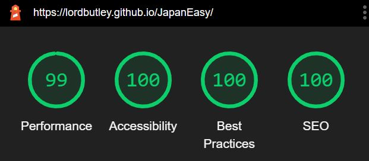
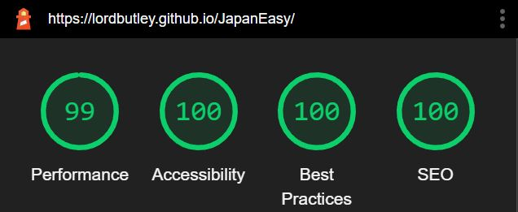

# Testing

 ## HTML

 - No errors were returned when passing through W3C HTML validator. A warning arises from having an empty heading. However this is to be expected as the contents are passed after load by Javascript

 - W3C (https://validator.w3.org/)

 ## CSS

 - No errors were returned when passing through W3C CSS validator.
 
 - W3C (https://jigsaw.w3.org/css-validator/validator)

## JavaScript

- No warnings or errors returned when passing through JShint

- JShint (https://jshint.com/)

 ## Lighthouse

Live site was tested by checking all links across four screen widths.

When an initial Lighthouse audit was completed on all pages, scores of around 75 were given for performance. This was due to the background image being too large and a JPG. After converting to webp format the score was raised to 100.

After the two above bugs were fixed the average (across all pages) Lighthouse ratings were as follows:

Desktop:

Mobile:

The Lighthouse audit was still scoring 75 after changing the format of the image and shrinking. In order to increase this score I added a lower resolution version of the same background image and added a media query so that for mobile devices a lower resolution picture would be loaded thats more suited to a smaller screen. The resulting score is shown below:

## User Stories Testing
1. As a user visiting the site for the first time, I want to navigate the site intuitively.
    * A user is greeted on the home page with a giant start button and obvious controls above. 
    * The logo and the start button provide user feedback when hovered over.
    * There is a short and concise description of what to do on the website and how to do it .
2. As a user visiting the site for the first time, I want to play the game quickly and easily.
    * A user can start a game as soon as they enter the sign as there game choices are set to a default.
    * A user can see straight away the radio button which are intuitive and in keeping with ux norms. Within a few seconds they can be playing not only a game, but the game of their choosing.
3. As a user, I want to be able to access the website on desktop, tablet and mobile devices, to ensure convenience.
    * Users who are browsing on Chrome, Safari, Microsoft Edge or Firefox can use the website on desktop, tablet and mobile devices with full responsiveness.
4. As a user, I want to be able to easily access the social media accounts of "JapanEasy"
    * A user can access the social media accounts of "JapanEasy" from the footer on every page. 
    * The icons provide feedback to the user.
5. * As a user, I want to be provided with feedback such as correct and incorrect scores to allow me to monitor my      learning progress.
    * A user is provided with their scores constantly throughout the game, updating after each answer.
    * A user is provided with their overall score when they complete the quiz or they click on End Game
6. As a user, I want to be able to choose whether the questions are in English or Hiragana.
    * A user can choose whether to be asked questions in English or Hiragana on the home page.
7. As a user, I want to be able to set the difficulty of the quiz
    * A user can set the difficulty of the quiz on the home page to either easy, medium or hard.
8. As a user, I want the questions *and* answers to be randomised to help with learning.
    * The quiz randomly generates answers for each question and as such the odds of getting the same answers for any question are incredibly small. The order of the questions is also randomised.

## Manual Testing 

In order to ensure that the website is fully responsive across screen sizes, I used Google Developer Tools as well as Responsinator. I manually went through each page and checked through all potential break points starting with a large viewport and working my way down to 320px wide. All steps below were check across laptop, tablet and phone screen sizes.

  * Navigation - Repeated steps on all pages.
        * Click on logo to confirm that it reloads the home page
        * Click on all social media links to test that they direct to the right site as well as opening a new tab.
        * Check that the alignment of text changes for smaller viewports and still fits within the container
        * Check that the buttons to start game, end game and try again cause the page to change correctly
    
    * User feedback - Repeated steps on all pages
        * Check that the buttons to start game, end game and try again have a red border when hovered over.
        * Check that all quiz answers have a red border when hovered over.
        * Check that all social media links are turn red when hovered over
        * Check that the answer chosen turns the *correct* colour ie Green is the answer is indeed correct and red otherwise.

    * Quiz questions
        * Check that the language choice correctly affects the question and answer language.
        * Check that the questions are randomly ordered.
        * Check that the difficulty setting changes the number of answers provided.
        * Check that each question is only asked once is played through to the end of the syllabary.
        * Check that the incorrect answers are random and different every time.
        * Check that the correct answer always appears in the answer set and only appears once.
    
    * Score Counters
        * Check that incorrect and correct answers are accurately dislayed whilst playing the quiz.
        * Check that the correct tallies are shown at the end of the quiz.
        * Check that the counters are all reset once a new game is selected.

## Bugs

### Resolved Bugs

1. - Issue - Upon clicking an answer, another answer could be clicked and the score counted before the next question showed.

- Resolution - I created a function which removed the onclick attribute of all other buttons. This was then added to the set of functions called when an answer is chosen. As the quiz questions and answer buttons are all generated from JavaScript, a fresh set of buttons is created for each question and so this function has no negative knock on effects.

2 - Issue - Upon starting a new game, the score counters showed the score from the previous game.

- Resolution - I added to the resetGame function code to set the innerHTML of both counters to 0 at the start of each game.

### Existing Bugs

There are no known bugs at the point of deployment.

### Testing deployed site.

*   Additional testing was completed on the deployed website to ensure that it matched the final development version. All pages, links, sections and content were checked.

      
     